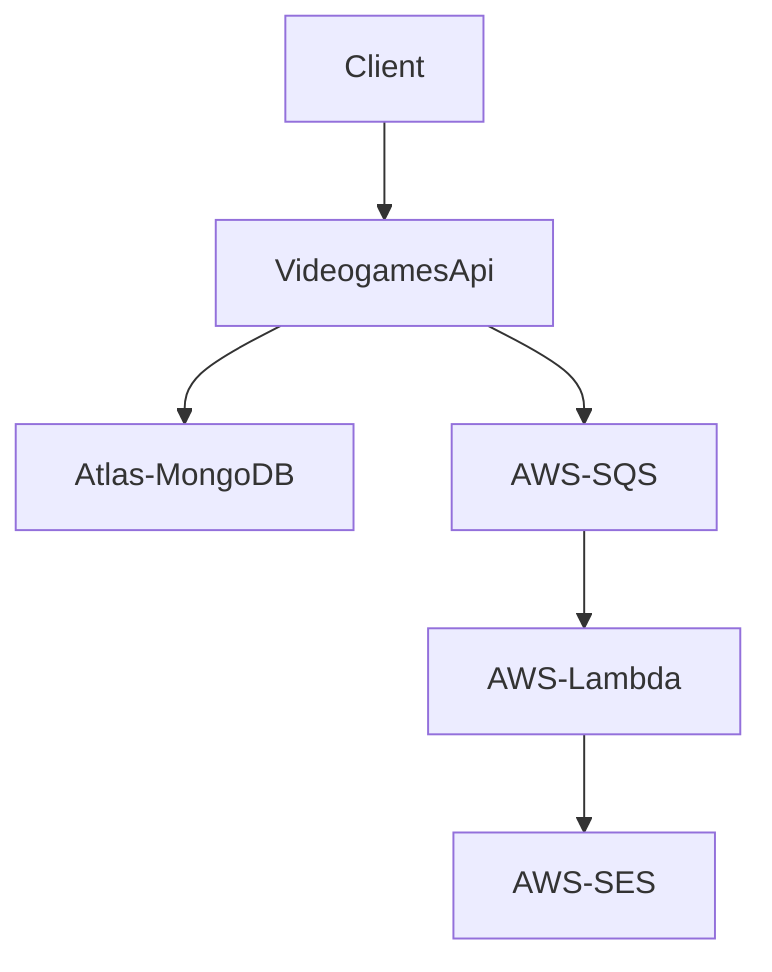

# Videogames Inventory
Hi there :wave: ! This is a videogame inventory app, my test project.  

<br>

# Getting Started

First of all, after clone the project run the next command to install the dependencies:
```
npm install
```
<br>

Before you run the project, you have to create a .env file:
```
cp .env.example .env
```

<br>

You can run your project locally by using `Docker` or running the following command: 
```
npm run dev
```

<br>

To run tests on the project run:
```
npm run test
```

<br>
<br>

# Workflow Diagram:


<br>

Our friends:
- [NodeJS :coffee:](https://nodejs.dev):
- [Express](https://expressjs.com)
- [Docker :whale:](https://www.docker.com)
- [AWS SQS](https://aws.amazon.com/sqs/)
- [AWS SES :email:](https://aws.amazon.com/ses/)
- [AWS Lambda](https://aws.amazon.com/lambda/)
- [Atlas MongoDB](https://www.mongodb.com/atlas)
