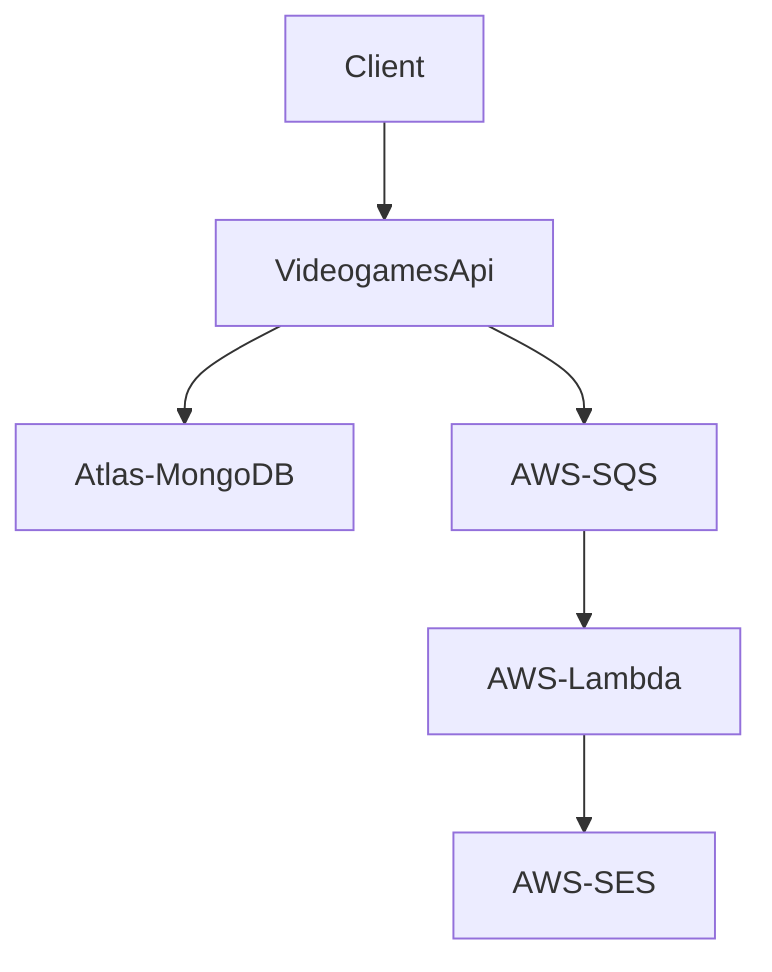

# Videogames Inventory

Hi there :wave: ! This is a videogame inventory app, my test project. This app is very small, just a basic CRUD operation for videogames.

## How it works?

The project is built with NodeJS + Express. Created games are stored in a database, on development was using Atlas.
On each CRUD action made on any game, it will send an event to AWS SQS.  
When the event reaches the queue it will trigger an AWS Lambda function that is in charge to send an e-mail through AWS Simple Email Service.

[Click here](#workflow-diagram) to see the flow chart.
### Features

- MVC Pattern, resting on mongoose
- Functional tests made with Jest
- Eslint to ensure a code standard
- Husky to manage pre-commit and pre-push with hooks
- Multi environment support
- JWT for authorization
- Dockerized

<br>

# Getting Started

First of all, after clone the project run the next command to install the dependencies:
```
npm install
```
<br>

Before you run the project, you have to create a .env file and set env vars:
```
cp .env.example .env
```

<br>

You can run your project locally by using `Docker` or running the following command: 
```
npm run dev
```

<br>

To run tests on the project enter:
```
npm run test
```

<br>
<br>

# Workflow Diagram


<br>

## Our friends:
- [NodeJS :coffee:](https://nodejs.dev):
- [Express](https://expressjs.com)
- [Docker :whale:](https://www.docker.com)
- [AWS SQS](https://aws.amazon.com/sqs/)
- [AWS SES :email:](https://aws.amazon.com/ses/)
- [AWS Lambda](https://aws.amazon.com/lambda/)
- [Atlas MongoDB](https://www.mongodb.com/atlas)
